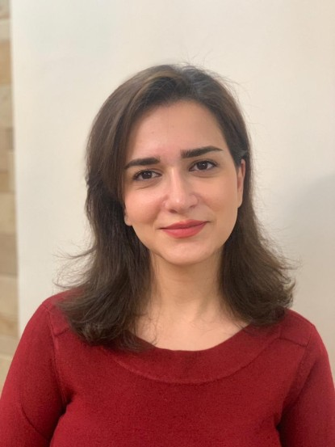
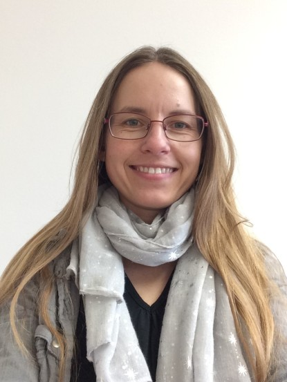

## **Principal Investigator**

### Prof. Dr. Florian Kattner

<table class="table table-hover">
<col style="width:70%">
<tr>
  <td> 
  *Health and Medical University*
  
  Department of Psychology
  
  &#128234; Schiffbauergasse 14, 14467 Potsdam

  &#128231; florian.kattner@health-and-medical-university.de

  [**CV**](cv.html)  
  
  [Google Scholar](https://scholar.google.de/citations?user=B9XMk0cAAAAJ&hl=de), [ORCID ID](https://orcid.org/0000-0003-2124-2829), [ResearchGate](https://www.researchgate.net/profile/Florian_Kattner), [Loop](https://loop.frontiersin.org/people/501598/overview)
  
  </td>
  <td>
  
  </td>
</tr>
</table>

## **Doctoral Students**

### Samuel Conrad, M.Sc.

<table class="table table-hover">
<col style="width:70%">
<tr>
  <td> 
  *Health and Medical University*
  
  Department of Psychology
  
  &#128234; Schiffbauergasse 14, 14467 Potsdam
  
  &#128231; samuel.conrad@health-and-medical-university.de
  
   

  

  
CV

  **2021-present**, Doctoral Student, [Health and Medical University](https://www.health-and-medical-university.de/) Potsdam, Germany
  
  **2021**, M.Sc. in Psychology, [Technical University of Chemnitz](https://www.tu-chemnitz.de/hsw/psychologie/institut/index.php), Germany
  
  **2018**, B.Sc. in Psychology, [University of Kassel](https://www.uni-kassel.de/fb01/institute/institut-fuer-psychologie/), Germany
  

  

  </td>
  <td></td>
</tr>
</table>

### Mitra Hassanzadeh Dehka, M.Sc.

<table class="table table-hover">
<col style="width:70%">
<tr>
  <td> 
  currently at *Technical University of Darmstadt*

  Institute of Psychology

  &#128234; Alexanderstr. 10, 64283 Darmstadt

  &#128231; mitra.hassanzadeh@tu-darmstadt.de

  [Website](https://www.kog.psychologie.tu-darmstadt.de/angewandte_kognitionspsychologie_kog/team_kog/team_kog_details_72576.en.jsp)
  </td>
  <td></td>
</tr>
</table>

### Alexandra Clausen, M.Sc.

<table class="table table-hover">
<col style="width:70%">
<tr>
  <td> 
  currently at *Technical University of Darmstadt*

  Institute of Psychology

  &#128234; Alexanderstr. 10, 64283 Darmstadt
  
  &#128231; clausen@psychologie.tu-darmstadt.de
  
  [Website](https://www.kog.psychologie.tu-darmstadt.de/angewandte_kognitionspsychologie_kog/team_kog/team_kog_details_54528.en.jsp)
  
  

  
CV

**2020-present** 	Lecturer for practical training in experimental research [Experimentalpsychologisches Praktikum], Institute of Psychology, Technical University of Darmstadt, Germany

**10/2019–03/2020** 	Lecturer for practical training in experimental research [Experimentalpsychologisches Praktikum], Institute of Psychology, Technical University of Darmstadt, Germany

**11/2019** 	Recipient of a research award of the Department of Human Sciences for an innovative doctoral research proposal, Technical University of Darmstadt, Germany

**10/2018–03/2019** 	Co-Lecturer for practical training in experimental research [Experimentalpsychologisches Praktikum], Institute of Psychology, Technical University of Darmstadt, Germany

**08/2018–present** 	Research Associate (doctoral candidate), Applied Cognitive Psychology Lab (Prof. Wolfgang Ellermeier), Technical University of Darmstadt, Germany

**09/2017–07/2018** 	Teacher in training, PGCE in Mathematics, University of Worcester, Worcester, UK

**02/2017–08/2017** 	Student, SKE in Mathematics, University of Sussex, Brighton, UK

**04/2016-08/2017** 	Teaching Assistant, South Bromsgrove High School, Bromsgrove, UK

**11/2015-04/2016** 	Teaching Assistant, The Chase School, Malvern, UK

**08/2015-12/2015** 	Support Worker, Safehands Recruitment, Worcester, UK

**01/2015-07/2015** 	Live Skills Instructor, Options Malvern View residential care home (prior AALPS Midlands), Hanley Castle, Worcester, UK

**10/2013–11/2014** 	Student, M.Sc. in Psychology, University of Essex, Colchester, UK (Research focus: Neuroscience)

**03/2013-09/2013** 	Self-employed, Public Relations, Communication and Congress Service, Bichl, Germany

**08/2011-09/2011** 	Intern at the Department of Fundamentals and Development, Zentrum Informationsarbeit Bundeswehr (prior AIK), Strausberg, Germany

**05/2009-12/2012** 	Student Assistant at the Department “Denkmalforschung und Denkmalerfassung”, Bayerisches Landesamt für Denkmalpflege, Munich, Germany

**10/2007-03/2013** Student, M.A. in Theatre Studies, Psychology, German Medieval Language and Literature, Ludwig-Maximilians-Universität München, Munich, Germany 

  
Publications

  Kattner, F. & Clausen, A. (2020). Revisiting the prioritization of emotional information in iconic memory. *Royal Society Open Science, 7*, 191507. https://doi.org/10.1098/rsos.191507. Authors contributed equally / shared first authorship
  
  Clausen, A., Kattner, F., & Salazar-Vogel, K. (2020, March). Effects of evaluative conditioning on the selection from iconic memory. *62nd Conference of Experimental Psychologists*, Jena, Germany.
  
  Clausen, A., Saul, C., & Kattner, F. (2019, September). Investigating ERP components resulting from evaluatively conditioned stimuli. *Annual Scientific Meeting of the British Association for Cognitive Neuroscience*, Cambridge, United Kingdom.
  
  Clausen, A. & Kattner F. (2019, April). Revisiting the prioritization of emotional information in iconic memory: A pre-registered replication study. *61st Conference of Experimental Psychologists*, London, United Kingdom.
    
  Clausen, A., Fenner, B., Kennett, S., & Cooper, N. R. (2014, September). Through the looking glass: An EEG investigation into the proposed social responding function of the human mirror neuron system. *Annual Scientific Meeting of the British Association for Cognitive Neuroscience*, York, United Kingdom.

  </td>
  <td></td>
</tr>
</table>

## **Student Assistants**

### Cosima Stokar von Neuforn

<table class="table table-hover">
<col style="width:70%">
<tr>
  <td>&#128231; c.stokar-von-neuforn@student.health-and-medical-university.de</td>
  <td></td>
</tr>
</table>

### Leonardo Stuff

<table class="table table-hover">
<col style="width:70%">
<tr>
  <td>&#128231; leonardo.stuff@student.health-and-medical-university.de</td>
  <td></td>
</tr>
</table>

### Daniel Tajik

<table class="table table-hover">
<col style="width:70%">
<tr>
  <td>&#128231; daniel.tajik@student.health-and-medical-university.de</td>
  <td></td>
</tr>
</table>

